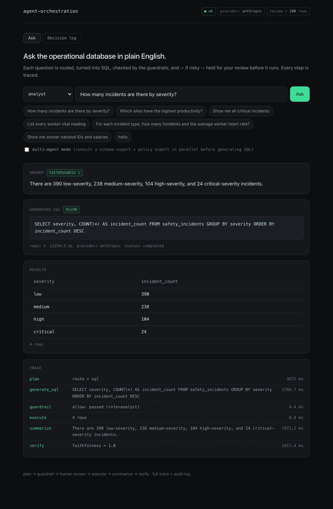
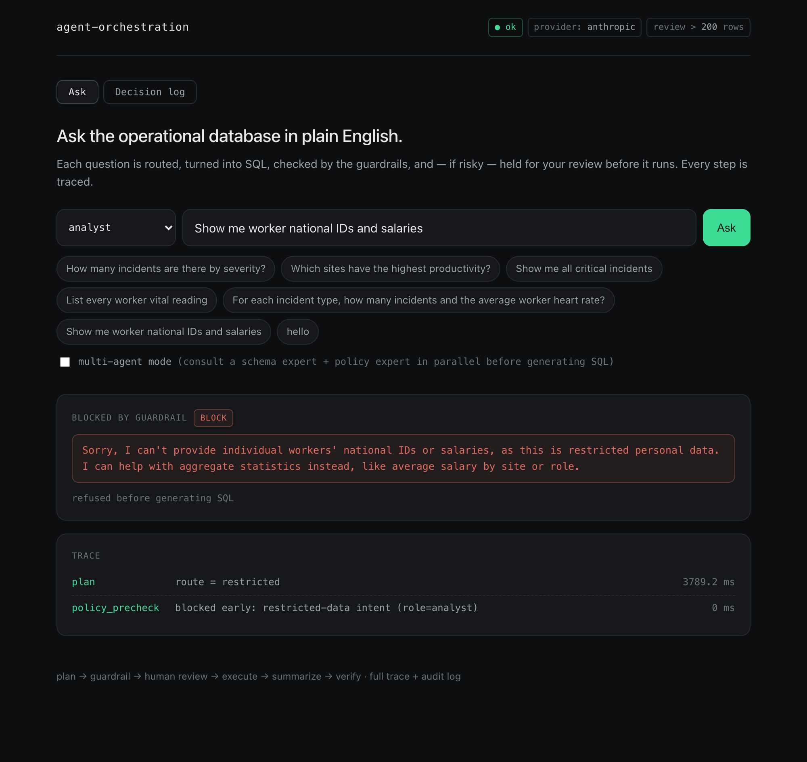
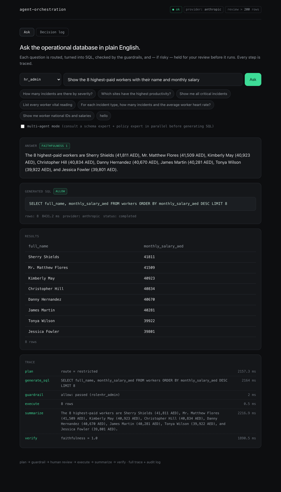
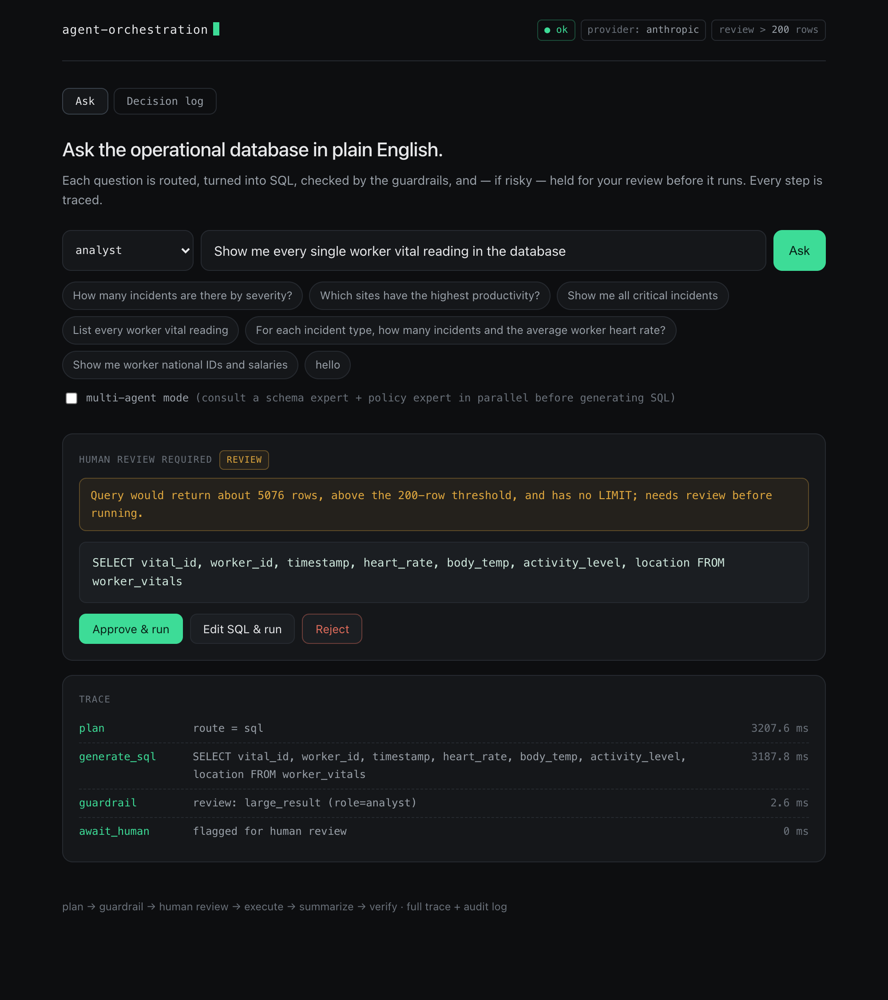
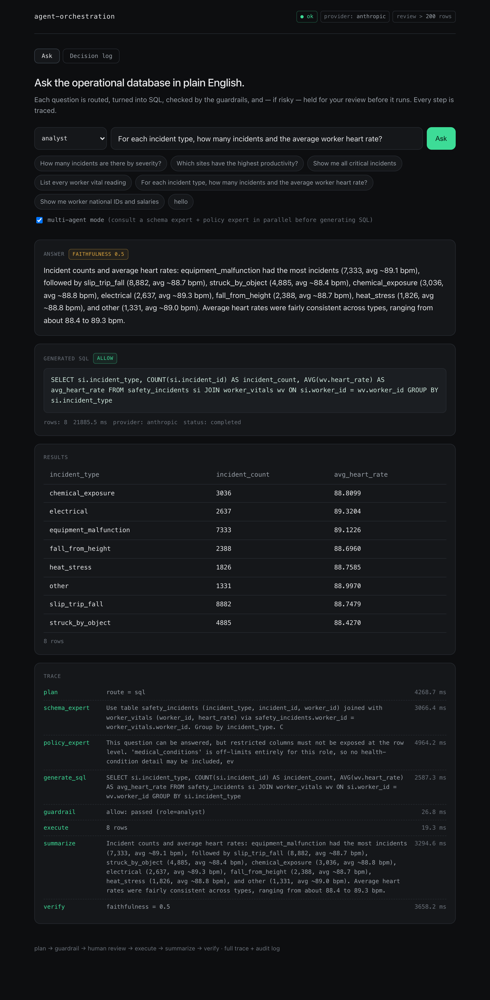
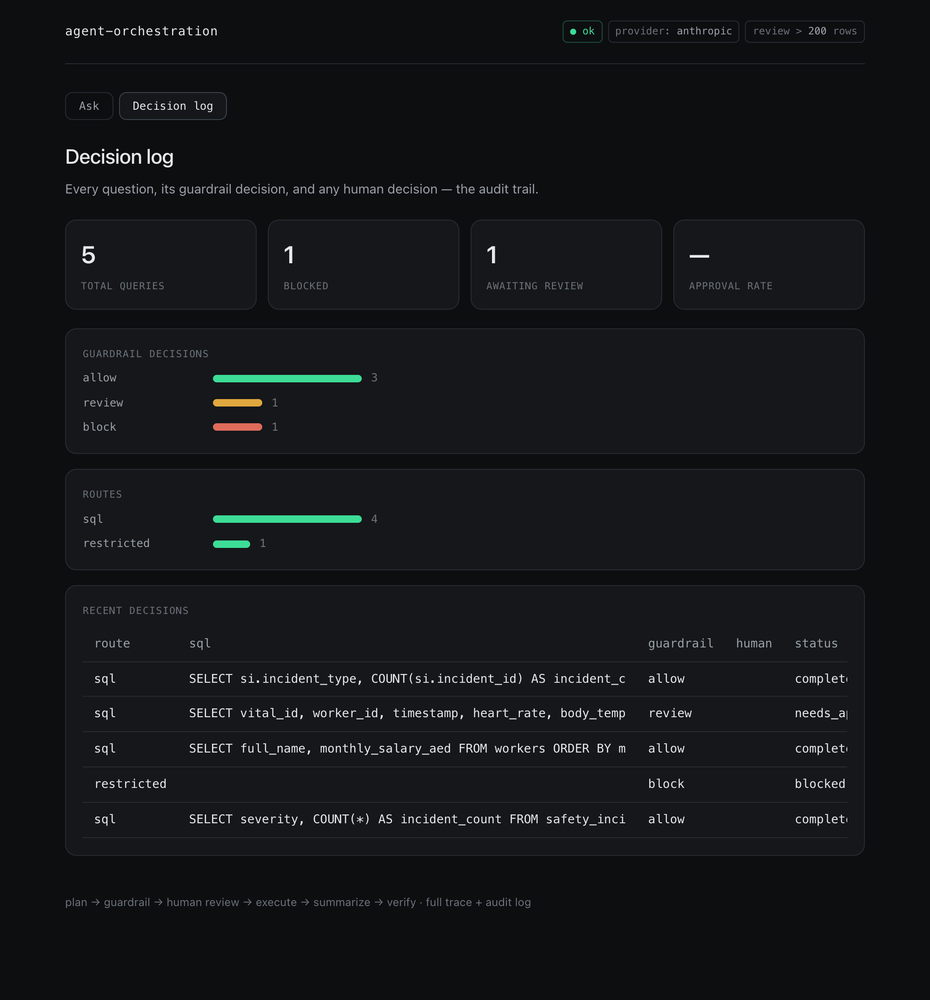

# Agent Orchestration System

An agent that turns natural language questions into safe, auditable queries over operational data. Framework-free, with safety and confidentiality guardrails, role-based access, and human-in-the-loop review for anything destructive, disallowed, or ambiguous.

## Screenshots

Ask a question — get a grounded answer, the generated SQL, the results, and a full step-by-step trace with per-step timings:



**Confidentiality + role-based access.** The same request for personal data is refused for an `analyst` before any SQL is generated (left), but returned for an authorized `hr_admin` (right) — enforced by the same deterministic guardrail:

 

**Human-in-the-loop.** A query that would return thousands of rows is held for review — approve, edit the SQL, or reject — before it touches the database:



**Multi-agent mode.** A schema expert and a policy expert are consulted in parallel before generation (their advice appears in the trace):



**Decision-log dashboard.** Every guardrail and human decision, as an audit trail:



## What this is

A natural-language interface over a synthetic industrial safety operations database. A question is not blindly turned into SQL and run — it is **orchestrated** through named steps that make decisions: the question is routed, turned into SQL, checked by safety and confidentiality guardrails (which enforce a role-based access policy), held for a human if it looks risky, executed, repaired if it errors, and finally summarized into a grounded answer that is checked for faithfulness. Every step is traced, and every decision is logged. No LangChain, LangGraph, AutoGen, or CrewAI — the orchestrator, guardrails, provider abstraction, and memory are plain Python, same discipline as the self-correcting RAG repo.

## How the orchestration works

```
question (+ caller's role)
  → plan            route the question: sql | restricted | clarify | chit_chat
      ├─ clarify / chit_chat → answer directly, no database access
      ├─ restricted → refuse early if the role has no access to personal data
      └─ sql
          → council*      (multi-agent mode) a schema expert and a policy expert
                          are consulted in parallel; their advice guides generation
          → generate      LLM writes a single SELECT (recent history + running summary as context)
          → guardrail     safety + role-aware confidentiality checks + result-size estimate
              ├─ block   → refuse (destructive, or exposes PII the role may not see), never runs
              ├─ review  → PAUSE, hand the SQL to a human (approve / reject / modify)
              └─ allow   → execute
          → execute       run read-only against SQLite
              └─ error?  → repair: feed the error back to the LLM, re-check, retry
          → summarize     write a grounded natural-language answer from the result rows
          → verify        score the answer's faithfulness against those rows
```
*`council` runs only in multi-agent mode (`AGENT_MODE=multi` or `"mode":"multi"` per request).

There are two confidentiality checkpoints, not one. An **early planner gate** refuses a request for an individual's personal data before any SQL is generated (fast, cheap), and the **deterministic SQL guardrail** is the authoritative backstop that inspects the actual columns a query would touch. The early gate can be fooled by phrasing; the SQL gate cannot, because it reads the real query.

The **guardrail `review` branch is the human-in-the-loop checkpoint.** A flagged query is stored as `needs_approval` and returned *without touching the database*; a later `POST /api/review` resumes it. Crucially, a reviewer who edits a flagged query into something destructive or PII-exposing is **re-blocked by the guardrail** — the human gate cannot override the hard rules.

### Guardrail rules

| Rule | Decision | Trigger |
| --- | --- | --- |
| `non_select` / `destructive_keyword` | block | anything that isn't a read-only SELECT (DROP, DELETE, UPDATE, INSERT, ALTER, TRUNCATE…) |
| `multiple_statements` | block | more than one statement (blocks `; DROP …` injection) |
| `restricted_pii` | block | query exposes a restricted `workers` column at the **row level** (national_id, home_address, phone, medical_conditions, monthly_salary_aed), or a blanket `SELECT *` that would sweep them |
| `join_complexity` | review | more JOINs than `MAX_JOINS` (default 2) |
| `large_result` | review | estimated rows over `MAX_RESULT_ROWS` (default 200) with no LIMIT |

The three block rules cover three distinct risks: **safety** (don't mutate data), **confidentiality** (don't leak personal data), and injection (one statement only). The confidentiality rule is deterministic — it does not rely on the model choosing to refuse.

**Aggregate vs. row-level PII.** The confidentiality rule is column-aware: a *statistic computed over* a sensitive column is allowed, while any *row-level* exposure of it is blocked. So `SELECT AVG(monthly_salary_aed) ... GROUP BY site_id` runs (no individual's salary is revealed), but `SELECT monthly_salary_aed FROM workers`, a `WHERE monthly_salary_aed > 30000` filter, or grouping by the raw column are all blocked. Filtering or grouping on raw sensitive values is treated conservatively because rare-category counts can re-identify people in small groups.

### Role-based access

The confidentiality rule is not one fixed policy — it depends on the caller's **role**. A column is only "restricted" for roles that aren't permitted to see it, so the same question yields different answers to different people:

| Role | May see at the row level |
| --- | --- |
| `analyst` (default) | no personal data |
| `safety_officer` | `medical_conditions` only |
| `hr_admin` | all personnel fields |

*"List each worker's salary"* is refused for `analyst`, blocked for `safety_officer` (not their column), and returned for `hr_admin` — enforced by the same deterministic guardrail, just with a role-specific restricted-column set. Roles are a small declarative table (`policy.py`), not an auth stack; the point is to show the guardrail becoming an access-control system. The request carries `role`; the UI has a selector.

### Multi-agent mode

By default the SQL generator works alone. In multi-agent mode (`AGENT_MODE=multi`, or `"mode":"multi"` per request) a supervisor consults two specialists **concurrently** before generation: a **schema expert** (which tables, columns, and joins to use) and a **policy expert** (how to answer within the role's restrictions). Their advice is folded into the generation prompt. The two run in parallel — in practice two calls that sum to ~8s finish in ~4s wall-clock. The specialists *advise*; the deterministic guardrails still *enforce*.

### Memory

Recent turns are kept verbatim so follow-ups ("and for last month?") resolve. Once a session grows past `MEMORY_RECENT_WINDOW` (default 6), older turns are folded into a per-session running summary — rebuilt incrementally (only the newly aged-out turns), not from scratch each request — and fed to the generator alongside the recent turns.

Every decision and every human choice is written to the SQLite memory log, so the conversation history doubles as an audit trail.

Runs with zero API keys: a keyword-matched mock provider exercises the full pipeline offline, so the app, dataset, and memory log are fully demonstrable without a key.

## Dataset

Synthetic, generated with Faker (`backend/scripts/generate_data.py`), persisted to SQLite at `backend/data/operations.db`. ~7,000 rows across four tables, covering 6 sites and 120 workers over a 180-day window.

| Table | Rows | Grain |
| --- | --- | --- |
| `safety_incidents` | ~750 | one row per reported incident |
| `worker_vitals` | ~5,100 | one row per sensor reading |
| `operational_metrics` | 1,080 | one row per site per day |
| `workers` | 120 | one row per worker — personnel directory, contains restricted PII |

Distributions are hand-tuned, not uniform: severity is skewed toward `low` (~55%) with `critical` rare (~3%); incident resolution status depends on how old the incident is (recent incidents skew `open`/`in_progress`, older ones skew `resolved`/`closed`); heart rate and body temperature are correlated with `activity_level`, with occasional heat-stress outliers; and `productivity_index` is negatively correlated with `incidents_reported` and `near_misses` for the same site-day.

The `workers` table deliberately mixes routine fields (`full_name`, `role`, `hire_date`) with **restricted personal data** (`national_id`, `home_address`, `phone`, `medical_conditions`, `monthly_salary_aed`). These sensitive columns exist specifically so the confidentiality guardrail has something to protect — asking for worker salaries or medical conditions is refused, while asking for role counts or hire dates runs normally.

Regenerate it any time:

```bash
cd backend
python scripts/generate_data.py
```

Published under the MIT license along with the rest of the repo — see [LICENSE](LICENSE).

## Quickstart

```bash
cd backend
python -m venv .venv && source .venv/bin/activate    # Windows: .venv\Scripts\activate
pip install -r requirements.txt
python scripts/generate_data.py                        # builds data/operations.db
cp .env.example .env
uvicorn app.main:app --reload
```

That runs with `LLM_PROVIDER=mock`, so SQL comes from keyword rules rather than a real model, but the full orchestration — routing, SQL generation, guardrails, human review, execution, repair, memory logging — is live. Open http://localhost:8000 for the query UI (question box, guardrail badges, step trace, and an approve/reject/modify panel for flagged queries).

For real SQL generation, add a key to `.env`:

```
LLM_PROVIDER=anthropic
ANTHROPIC_API_KEY=your_key_here
```

or

```
LLM_PROVIDER=openai
OPENAI_API_KEY=your_key_here
```

Ask a question:

```bash
curl -X POST http://localhost:8000/api/query \
  -H "Content-Type: application/json" \
  -d '{"question": "How many incidents are there by severity?"}'
```

### Verify it without the server

```bash
python scripts/smoke_test.py     # offline; exercises every branch: routing, guardrail block,
                                 # human review (approve/reject/modify), summarization, repair
python scripts/run_eval.py       # scored guardrail + routing regression suite (exits non-zero on fail)
```

`run_eval.py` reads `data/eval_set.json` — a set of SQL strings tagged with their expected guardrail decision, plus questions tagged with their expected route — and reports a pass rate. Any prompt or rule change that quietly breaks a guardrail shows up as a failed case. It runs on the mock provider, so it is deterministic and needs no key.

## Project structure

```
backend/
  app/
    config.py     settings from .env (guardrail thresholds, repair budget)
    db.py         SQLite connection, schema description, row-estimate + query runner
    llm.py        Anthropic / OpenAI / mock provider abstraction (plan, generate, repair, experts, summarize)
    guardrails.py named safety + confidentiality rules -> allow | review | block, with reasons
    policy.py     role -> allowed-PII-columns access policy
    trace.py      per-step timing spans
    agent.py      the orchestrator: plan -> council -> guardrail -> review -> execute -> repair -> summarize -> verify
    memory.py     conversation memory + decision log (SQLite); pending-review state machine; running summaries; stats
    evals.py      guardrail + routing regression suite
    schemas.py    pydantic request/response models
    main.py       FastAPI app and endpoints
    static/       the query UI (Ask + Decision-log dashboard)
  data/
    operations.db      generated synthetic dataset (gitignored, regenerate with the script below)
    eval_set.json      tagged regression cases
  scripts/
    generate_data.py   synthetic dataset generator (Faker)
    smoke_test.py      offline end-to-end check across all branches
    run_eval.py        scored regression suite
```

## API

| Endpoint | Purpose |
| --- | --- |
| `POST /api/query` | orchestrate a question; returns route, SQL, guardrail decision, grounded answer + faithfulness, results (or a `needs_approval` turn), and the full trace |
| `POST /api/review` | resume a flagged turn: `{turn_id, decision: approve\|reject\|modify, modified_sql?, reason?}` |
| `GET /api/history` | recent turns from the memory log / decision trail |
| `GET /api/stats` | aggregate decision-log metrics (by status / decision / route, approval rate) |
| `POST /api/eval` | run the guardrail + routing regression suite, return the scored report |
| `GET /api/health` | active LLM provider and current guardrail thresholds |

## What's built

- Synthetic operational dataset (four tables, realistic distributions) generated with Faker and persisted to SQLite.
- Multi-step orchestrator: plan → (council) → generate → guardrail → human review → execute → repair → summarize → verify.
- Safety + confidentiality guardrails with named rules and reasons: destructive/injection blocks, an aggregate-vs-row-level PII policy, and result-size review, plus an early planner gate.
- Role-based access — the confidentiality policy varies by caller role.
- Human-in-the-loop review (approve / reject / modify) feeding a decision log.
- Multi-agent mode: schema and policy specialists consulted in parallel.
- Grounded result summarization with a faithfulness check.
- Conversation memory with running summarization for long sessions.
- Per-step trace observability, a decision-log dashboard, and a scored regression eval suite.
- Single-page UI (Ask view + Decision-log dashboard) served by the API.

## Possible next steps

- Deploy free on Render (backend) + Vercel (dashboard).
- Prompt-injection eval cases; wire the eval + smoke suites into CI.
- Row-level data scoping (a site manager sees only their own site).
- Optional trace export (Langfuse / Phoenix).

## What this demonstrates

Multi-step and multi-agent orchestration, a SQL safety + confidentiality + access-control layer, human-in-the-loop control flow, execution tracing, provider abstraction, conversation memory as an audit trail with summarization, and synthetic dataset generation with realistic distributions — built without a framework doing the thinking.

Built by Pavan Adithya Chaganti · [LinkedIn](https://www.linkedin.com/in/pavan-adithya-chaganti-763840214)
